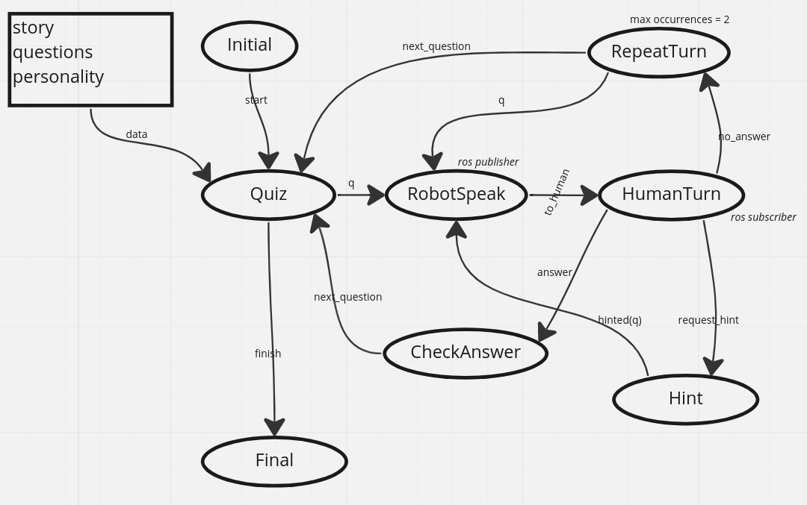

# futuro_remoto

<details><summary>Install</summary>
```sh
mkdir ~/ros_ws
cd ~/ros_ws
```

Clone the repo as source folder
```sh
git clone git@github.com:Prisca-Lab/quiz_futuro_remoto.git src
git submodule update --init --recursive
```

Build and source
```sh
cd ~/ros_ws
catkin build
source devel/setup.sh
```
</details>

## Prepare the robot

Kill the alive movements from `ari-19c:8080`
The nodes to be paused are:
- interaction_profile_manager
- head_manager
- pal_chrome

or kill from the terminal

```sh
rosnode kill /interaction_profile_manager 
rosnode kill /head_manager
rosnode kill /pal_chrome
```
## Let's start the quiz

Launch the quiz.
Two options are available:
1. `roslaunch quiz run.launch` is using the microphone for intent recognition
2. `roslaunch quiz run_keyboard.launch` is using the keyboard for intent recognition

Both launch files require arguments `user_id` and `condition`. The arguments can also be accessed from the ros param server.

### Standard Mode
In this mode, the user input is expected to be received via the microphone with `_device:=-1` (check the audio device with `arecord -l`)

The parameter for selecting the audio device is found in `quiz/launch/run.launch:L14`

```sh
roslaunch quiz run.launch user_id:=1 condition:=2
```

If the intent recognition is not working, use the keyboard mode.

### Keyboard Mode

```sh
roslaunch quiz run_keyboard.launch user_id:=1 condition:=2
```

The conditions are following:
1. SIDE ANTAGONIST
2. SIDE AGREEABLENESS

If a bag is already recorded containing data from the user, an error is raised and returned to user.


<details><summary>State Machine</summary>

</details>

The four packages are:
1. quiz
2. picovoice_ros
3. robot_behavior
4. keyboard_quiz


